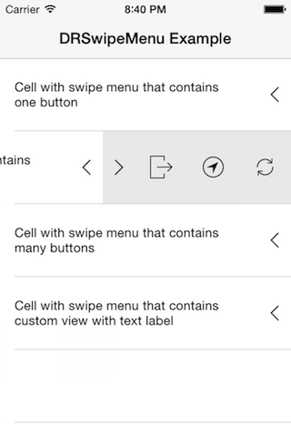
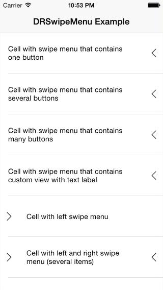

# DRSwipeMenu (iOS)

Customizable swipe-to-reveal menu for iOS apps. Originally implemented with support for iOS 7 and later. Currently compatible and tested on iOS 10. Written in Objective-C, but can be used in Swift projects as well.

 

## Instalation

You can integrate `DRSwipeMenu` with your project using CocoaPods. To do so, you will need to add following line to your Podfile:

    pod 'DRSwipeMenu', '~> 2.0'

You can also download zip archive of given release from [releases page](https://github.com/darrarski/DRSwipeMenu-iOS/releases).

## Usage

Check out included example project. It shows how to use swipe menu on `UITableViewCell`, but menu could be embedded anywhere in the view hierarchy. All public headers are documented.

## Changelog

See [CHANGELOG.md](CHANGELOG.md)

## License

The MIT License (MIT) - check out included [LICENSE](LICENSE) file

Icons used in example app comes from [icons8.com](http://icons8.com/) site.
